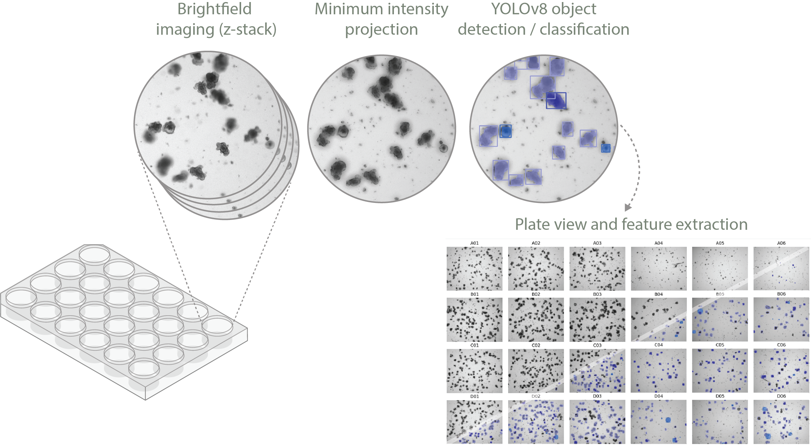

<h1>Instance Segmentation of Intestinal organoids and Spheroids from BrightField images using YOLOv8 (ISIS-BF)</h1>

This repository contains a number of tools to speed up the interpretation of images from intestinal organoids acquired using a widefield microscope (brightfield illumination). In our case an EVOS M7000 multiwell scanner which outputs the following filenames: _P1_Plate_M_p00_z00_0_A01f00d0_.

1. This tool uses the previously mentioned naming convention to extract the well_id from each image ("A01"), scan through all z-planes ("z00") and perform a minimum intensity projection.

2. Based on said projections a previously trained [YOLOv8 model](https://github.com/adiezsanchez/bf_intorg_YOLOv8_dev) predicts instances of 3 classes intestinal organoids: differentiated organoids, spheroids and dead/overgrown organoids.

3. It extracts counts of each object on a per class basis and morphology measurements such as area, perimeter, circularity.

4. Finally it generates two plate views of the entire multiwell plate at high resolution for data exploration (minimum intensity projection and segmentation). Filenames **must contain the well_id identifier** in order for the scripts to work and plot the plate views.

<h2>Instructions</h2>

1. In order to run these Jupyter notebooks you will need to familiarize yourself with the use of Python virtual environments using Mamba. See instructions [here](https://biapol.github.io/blog/mara_lampert/getting_started_with_mambaforge_and_python/readme.html).

2. Then you will need to create a virtual environment (venv) either using the following command or recreate the environment from the .yml file you can find in the envs folder:

   <code>mamba create -n int_organoids python=3.9 devbio-napari cellpose pytorch torchvision plotly pyqt ultralytics -c conda-forge -c pytorch</code>

3. To recreate the venv from the environment.yml file stored in the envs folder (recommended) navigate into the envs folder using <code>cd</code> in your console and then execute:

   <code>mamba env create -f environment.yml</code>

4. (optiona) If you want to automatically save the resulting .png graphs install kaleido in the venv using pip:

   <code>mamba activate int_organoids</code>
   <code>pip install kaleido</code>

5. Once your virtual environment is ready you can copy all your folders containing the images from EVOS inside the data directory using the following structure:

<code>
intestinal_organoid_YOLOv8/   #Primary data folder for the project
├── data/                     #All input data is stored here. 
│   ├── Plate_01/
│   │   ├── P1_Plate_M_p00_z00_0_A01f00d0.TIF
│   │   ├── P1_Plate_M_p00_z01_0_A01f00d0.TIF
│   │   └── ...
│   ├── Plate_02/
│   │   ├── P2_Plate_M_p00_z00_0_A01f00d0.TIF
│   │   ├── P2_Plate_M_p00_z01_0_A01f00d0.TIF
│   │   └── ...
│   └── ...
</code>

6. The easiest way to interact with the analysis code is via Jupyter Lab. To launch a jupyter lab server run the following commands:
   <code>mamba activate int_organoids</code>
   <code>jupyter lab</code>

7. Open 1_image_analysis.ipynb, define your username and desired resolution for the output plates and run all the cells.
