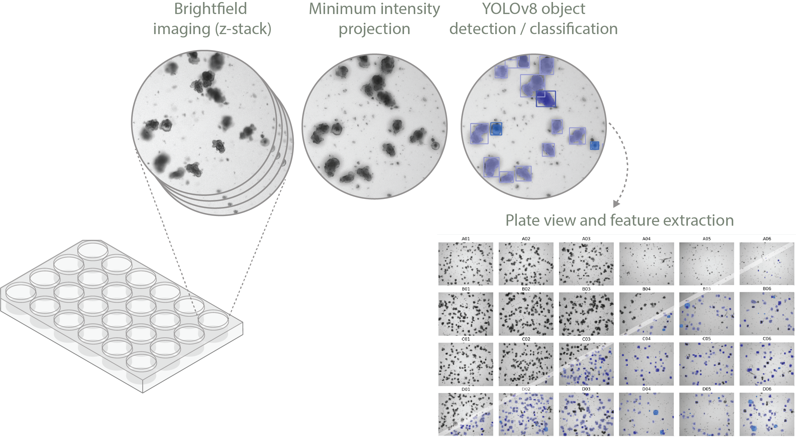
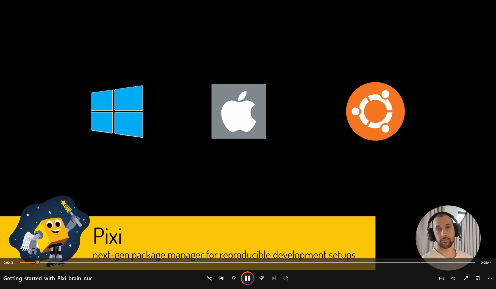

<h1>Instance Segmentation of intestinal Organoids and Spheroids from BrightField images using YOLOv8 (ISiOS-BF-YOLO)</h1>

This repository contains a number of tools to speed up the interpretation of images from intestinal organoids acquired using a widefield microscope (brightfield illumination). In our case an EVOS M7000 multiwell scanner which outputs the following filenames: _P1_Plate_M_p00_z00_0_A01f00d0_.

1. This tool uses the previously mentioned naming convention to extract the well_id from each image ("A01"), scan through all z-planes ("z00") and perform a minimum intensity projection.

2. Based on said projections a previously trained [YOLOv8 model](https://github.com/adiezsanchez/bf_intorg_YOLOv8_dev) predicts instances of 3 classes of intestinal organoids: differentiated organoids, spheroids and dead/overgrown organoids.

3. It extracts counts of each object on a per class basis and morphology measurements such as area, perimeter, circularity and solidity.

4. Finally it generates two plate views of the entire multiwell plate at high resolution for data exploration (minimum intensity projection and segmentation). Filenames **must contain the well_id identifier** in order for the scripts to work and plot the plate views.

<h2>Input folder structure</h2>

You can copy all your folders containing the images from EVOS inside the data directory using the structure below. Alternatively point to a directory containing folders for each plate acquisition.

   <code>
   intestinal_organoid_YOLOv8/   #Primary data folder for the project
   ├── data/                     #All input data can be copied here. 
   │   ├── Plate_01/
   │   │   ├── P1_Plate_M_p00_z00_0_A01f00d0.TIF
   │   │   ├── P1_Plate_M_p00_z01_0_A01f00d0.TIF
   │   │   └── ...
   │   ├── Plate_02/
   │   │   ├── P2_Plate_M_p00_z00_0_A01f00d0.TIF
   │   │   ├── P2_Plate_M_p00_z01_0_A01f00d0.TIF
   │   │   └── ...
   │   └── ...
   </code>

<h2>How to install this tool? (Environment setup)</h2>

> [!TIP]
> In order to run these Jupyter notebooks and .py scripts you will need to familiarize yourself with the use of Python virtual environments, IDEs and Git. If you are not familiar with those concepts watch the [Before you start (Python, IDE and Git on Windows)](https://youtu.be/tzdFuxF2E3U) video, it will guide you through the necessary steps and cover all basic concepts.
> 
> TL;DR You are busy in the wet lab, skip to the Pixi section below.

Once you have your developer stack ready you can simply clone this repository using:

<code>git clone https://github.com/adiezsanchez/intestinal_organoid_yolov8</code>

If you do not have git installed you can dowload the code as a .zip file by clicking on the green < > Code button at the upper right corner of the repo.

Proceed to the next step either using **Mamba** or **Pixi** as your environment manager of choice.

1. Create a virtual environment (venv) either using the following command or recreate the environment from the .yml file you can find in the envs folder (step 2):

   <code>mamba create -n int_organoids python=3.9 napari pytorch torchvision plotly pyqt ultralytics python-kaleido -c conda-forge -c pytorch</code>

2. To recreate the venv from the environment.yml file stored in the envs folder (recommended) navigate into the envs folder using <code>cd envs</code> in your console and then execute:

   <code>mamba env create -f environment.yml</code>

3. (optional) If you want to automatically save the resulting .png graphs install kaleido in the venv using pip:

   <code>mamba activate int_organoids</code>

   <code>pip install kaleido</code>

4. The easiest way to interact with the analysis code is via Jupyter Lab. To launch a jupyter lab server run the following commands:

   <code>mamba activate int_organoids</code>

   <code>jupyter lab</code>

|  | Watch on YouTube | Description |
|-------|------------------|-------------|
|  | [Pipeline installation using Pixi](https://youtu.be/tzdFuxF2E3U) | TL;DR You are busy in the wet lab and want to get your hands on in this tool and start using it ASAP.  |

> [!TIP]
> [Pixi](https://pixi.sh/latest/installation/) allows for fully reproducible environments by using .lock files. 

After installing pixi, and cloning this repo type the command below. Once it is done installing your virtual environment it will launch a Jupyter Server in your browser so you can interact with the pipelines.

<code>cd intestinal_organoid_yolov8 && pixi run lab</code>

> [!WARNING]
> If you run into an ImportError (i.e. DLL load failed while importing _imaging), run the postfix-windows-dll task by typing <code>pixi run postfix-windows-dell</code>. Restart the kernel and import the modules again, this will fix the issue.

<h2>Usage instructions</h2>

1. Open <code>1_image_analysis.ipynb</code>, define your username and desired resolution for the output plates and run all the cells.

2. You will find all the results under <code>.output/USERNAME</code> 
3. To explore the extracted stats run <code>2_image_analysis.ipynb</code>

<h2>Materials and Methods: Image Analysis</h2>

Brightfield `.tif` images were acquired as z-stacks per well and processed plate-wise using Python 3.9 (`pytorch` 2.5.0, `ultralytics`, `scikit-image`, `pandas`). Files were grouped by `well_id` extracted from EVOS-compatible filenames, excluding non-z-stack images. For each well, z-planes were collapsed by minimum-intensity projection and saved as one projection image per well.

Instance segmentation was performed on each projection with a pretrained YOLOv8 model (`./models/GPU_1px_cle_eroded_labels.pt`) at confidence threshold 0.6, with classes `differentiated`, `undifferentiated`, and `dead`. Predicted instance masks were parsed per class and quantified with `skimage.measure.regionprops` to extract area, filled area, perimeter, circularity, eccentricity, and solidity for each object.

Per-object measurements were exported as plate-level CSV files, then aggregated to well-level summaries by computing class counts, mean morphology descriptors, and derived ratios (`dead_ratio`, `organoid_ratio`, `spheroid_ratio`). The workflow also generated high-resolution whole-plate visualization maps for minimum projections and YOLO predictions.

<h2>How to cite this pipeline</h2>

> [!NOTE]
> If you are using this pipeline to analyze your bioimage data you can easily include it in your references following the instructions below:

- For APA and BibTex style scroll to the top of this page, above the Release section and under About click on the cite this repository.

- For APA, Harvard, MLA, Vancouver, Chicago and IEEE styles, visit [Zenodo](https://doi.org/10.5281/zenodo.20085163) and in the right panel at the bottom you will find the Citation section. 

This is an example from APA, the most popular citation style:

<code>Díez-Sánchez, A. (2026). adiezsanchez/intestinal_organoid_yolov8: ISiOS-BF-YOLO (v1.0.0). Zenodo. https://doi.org/10.5281/zenodo.20085163 </code>